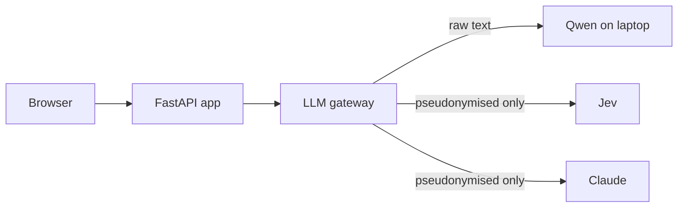

# Interview Simulator (Interview Coach)

Practise job and assignment interviews against your own vacancy and CV. The app plans a
realistic interview, runs it (typed or spoken), evaluates every answer with traceable
judgments, and gives grounded feedback, statistics and a practice plan. The report you download
can be uploaded into your next run, which then re-tests your weak points.

It combines three kinds of model, each doing what it is best at:

| Model | Runs | Used for |
|---|---|---|
| **Qwen 3.6 35B-A3B** (via Ollama) | locally, on a laptop over Tailscale | pseudonymisation, requirement extraction, embeddings, the interviewer's questions |
| **Jev** (TypeSafe) | API | fast typed judgments with confidence: answer quality, STAR elements, CV consistency, guardrails, next move |
| **Claude Sonnet 5 / Haiku 4.5** | API | interview plan, briefing, grounded feedback, practice plan, and every low-confidence case |



## What it demonstrates

- **Privacy by construction:** personal data is pseudonymised locally before anything leaves
  the server, and the rule is enforced by a type (`SafeText`) that external providers require,
  not by convention. Tests fail if raw text could reach Claude or Jev.
- **Confidence cascade:** Jev answers typed questions with a confidence; uncertain ones escalate
  to Claude. Every judgment records provider, confidence and escalation, and the review marks
  uncertain badges instead of hiding them.
- **Hallucination guardrails:** every interviewer question is checked (grounded, appropriate
  for Dutch hiring, on topic) before it is shown; feedback may only cite the user's own CV and
  answers, and a grounding check drops items it cannot support.
- **Model choice on numbers:** a benchmark compares local runtimes and models; usage, cost,
  latency and escalation rates are measured from day one (admin page, `coach usage`).
- **DevOps:** one gateway for all model calls with retries, timeouts, budget caps and
  content-free logging; CI with lint, types, tests and an eval subset; Docker; backups.

Design and trade-offs: [docs/architecture.md](docs/architecture.md) · decisions:
[docs/decisions.md](docs/decisions.md) · privacy: [docs/privacy.md](docs/privacy.md) ·
spec: [docs/scope.md](docs/scope.md).

## Status

| Milestone | State |
|---|---|
| M0 foundations | built; live smoke tests pending (`make live`) |
| M1 core loop (CLI) | built; first real run on the Defensie vacancy pending |
| M2 web app | built; deployment pending ([docs/deploy.md](docs/deploy.md)) |
| M3 review, stats, report | built |
| M4 follow-up runs | built |
| M5 speaking practice | built; faster-whisper speed on the server to be measured |
| M6 hardening | rate limits, retention, backups, health, eval runner built; eval set + threshold tuning pending |

## Metrics (filled in from real runs)

| | |
|---|---|
| Share of model calls handled locally | _tbd_ |
| Escalated to Claude | _tbd_ |
| Cost per 30-minute run | _tbd_ |
| Interviewer question latency (p50 / p95) | _tbd_ |

## Run it

```bash
uv sync                         # local tooling; no secrets needed for make check
ollama pull qwen3.6:35b-a3b && ollama pull bge-m3
# secrets: every variable is documented (empty) in .env.example; on a server, create the
# real .env with deploy/init-env.sh. Full self-hosting guide: docs/deploy.md

# command line (M1)
uv run coach run --vacancy vacature.pdf --cv cv.pdf --lang nl --length 15

# web app (M2+)
uv run coach create-admin --email you@example.com
make web                        # http://localhost:8000 (set SECURE_COOKIES=false locally)
```

Checks: `make check` (lint, types, 30+ tests with fake providers) · `make live` (real providers)
· `make eval` (Jev accuracy and threshold recommendations) · `make bench` (local model speed).

## Local model benchmark

Same interviewer turns and JSON extractions for each runtime and model (synthetic data in
`eval/bench/fixtures.py`); results land in `eval/bench/`.

```bash
uv run python scripts/bench_local.py \
  --target ollama:qwen3.6:35b-a3b --target ollama:qwen3.8:27b \
  --target ollama:qwen3.6:35b-mlx --target ollama:qwen3.8:27b-mlx
# oMLX, with Ollama stopped (OMLX_BASE_URL / OMLX_API_KEY in .env):
uv run python scripts/bench_local.py --target omlx:<model name shown in oMLX>
```
