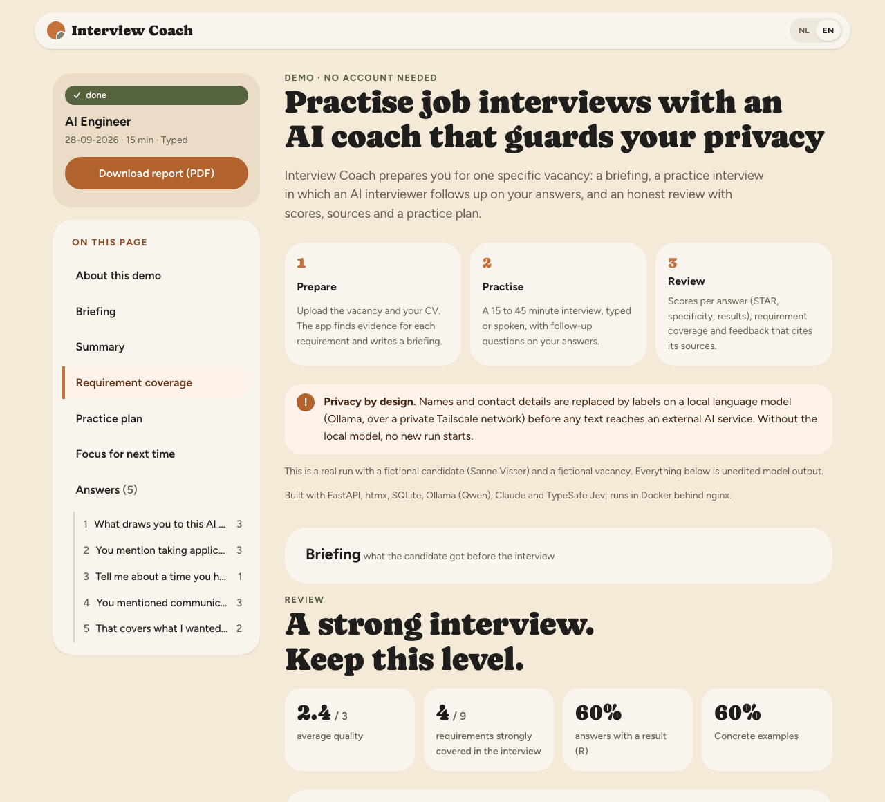
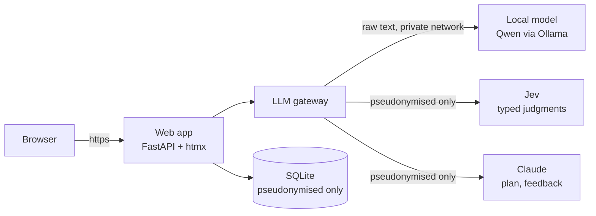
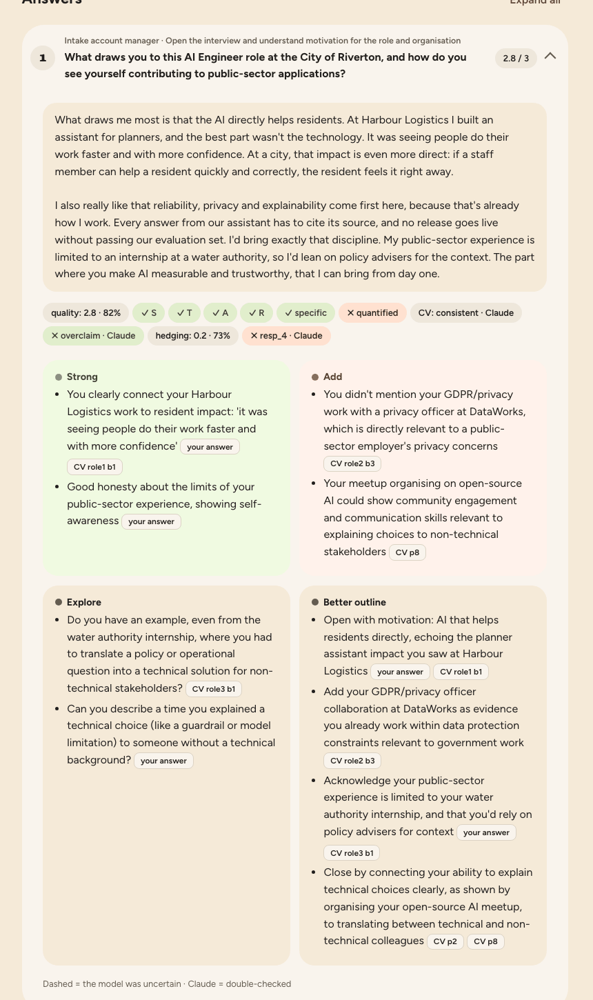

# Interview Coach

**Practise job interviews against a real vacancy and your own CV, with an AI coach that keeps
your personal data on your own hardware.**

Upload a vacancy and your CV. Interview Coach writes a briefing, runs a mock interview in which
an AI interviewer follows up on your answers, and gives you an honest review: scores per answer,
which requirements you covered, feedback that cites your CV and your own words, and a practice
plan. The PDF report carries its data along, so your next run re-tests your weak points.

**Live demo** (no account needed): _link added on publication_ · Dutch and English ·
a real run with a fictional candidate.

<picture>
  <source media="(prefers-color-scheme: dark)" srcset="docs/images/demo-overview-dark.png">
  
</picture>

## How it works



1. **Prepare** (~3 min): documents are parsed and **pseudonymised by a local model** (names and
   contact details become labels like `[PERSON_1]`), requirements are extracted, CV evidence is
   matched per requirement, and Claude writes the interview plan and a briefing.
2. **Interview** (15–45 min, typed or spoken): the local model asks one question at a time;
   **Jev** checks every question before you see it (grounded, appropriate, on topic) and decides
   whether to probe deeper; code keeps time for every planned topic.
3. **Review**: every answer is scored by Jev on quality, STAR elements, specificity, results,
   requirement evidence and consistency with your CV. Uncertain scores go to Claude for a second
   opinion. Claude writes feedback that may only cite your CV and your answers; a grounding check
   drops anything it cannot support.

Three kinds of model, each doing what it is best at: a **local LLM** for anything that touches
raw personal data, **Jev** (TypeSafe) for fast typed judgments with a confidence, **Claude** for
the long careful texts. Details and the reasons: [docs/models.md](docs/models.md).

## What makes it different

- **Privacy by construction.** External models only accept a `SafeText` type that only the
  pseudonymiser can create; tests fail if raw text could reach Claude or Jev. When the local model
  is offline, new runs are blocked rather than falling back to an external model.
- **Traceable scores.** Every badge stores provider, confidence and whether it was escalated; the
  review shows uncertain scores with a dashed border and double-checked ones with "Claude".
- **Guardrails on every question and every feedback item**, with a regenerate → escalate →
  safe-fallback chain.
- **Measured, not guessed.** Cost, latency, local share and escalation rate per run (admin page,
  `coach usage`).



## Numbers from real runs

Three 15-minute runs with a fictional candidate (5–7 answers each):

| | |
|---|---|
| API cost per run | €0.13–0.20 (Claude ~99 %, Jev ~€0.002) |
| Judgments per run | 175–230, of which 7–11 % escalated to Claude |
| Jev latency (p50) | ~0.27 s |
| Interview question, local Qwen 3.6 35B-A3B on Apple M1 Max (p50) | 4–6.5 s |
| Preparation (upload to briefing) | ~3 minutes |

## Run it yourself

| Guide | For |
|---|---|
| [Getting started](docs/getting-started.md) | everything on one computer: prerequisites, API keys, `.env`, first run (~30 min) |
| [Self-hosting on a server](docs/deploy.md) | https on your own domain, the model on your own machine over Tailscale, backups |
| [Models](docs/models.md) | which model does what, why Jev, where it is used, running without Claude, hardware, costs |

The short version:

```bash
git clone https://github.com/<owner>/<repo>.git interview-coach && cd interview-coach
uv sync
ollama pull qwen3.6:35b-a3b && ollama pull bge-m3
cp .env.example .env        # fill in the keys; every variable is explained there
make check && make live     # tests with fake models, then three tiny real calls
uv run coach create-admin --email you@example.com
make web                    # http://localhost:8000
```

**You need:** a machine that can run a 35B local model (e.g. Apple Silicon with 32 GB, or a
24 GB GPU; smaller models work with lower quality), an Anthropic API key (optional, see
[running without Claude](docs/models.md#running-without-claude-fully-local-writing)) and a
TypeSafe API key (required for Jev).

## Stack

Python 3.12 · FastAPI · Jinja2 + htmx + Alpine.js (no build step) · SQLite / SQLModel ·
WeasyPrint (PDF) · Ollama (Qwen 3.6, bge-m3) · TypeSafe Jev · Anthropic Claude · faster-whisper
(optional) · Docker · nginx · Tailscale · uv · ruff · mypy · pytest · GitHub Actions.

## Project documents

[Architecture](docs/architecture.md) · [Privacy and data handling](docs/privacy.md) ·
[Decisions](docs/decisions.md) · [Specification](docs/scope.md) · [Design notes](docs/design-handoff.md) ·
[Demo](demo/README.md) · [Evaluation](eval/README.md) · [Next steps](docs/next-steps.md)

## Development

```bash
make check      # ruff, format, mypy, pytest with fake providers (no keys, no network)
make live       # real providers
make eval       # Jev accuracy on the evaluation set, threshold suggestions
make bench      # local model speed (not yet measured on the reference setup)
make snapshots  # every page rendered with fictional data into design/snapshots/
```

Every model call goes through `app/llm/gateway.py`; model IDs, prompts and thresholds live in
`config/` and `prompts/`, never in code. Contributor rules for AI agents: [CLAUDE.md](CLAUDE.md).

## Status

**v1.0**: prepare, interview, review, PDF report, follow-up runs, web UI (NL/EN, light and dark),
public demo and self-hosting are complete and tested on real runs. Open: spoken answers need
more server resources than the reference setup has, the evaluation set still has to be written
to tune the thresholds, and a no-Claude configuration has not been tested end to end. See
[docs/next-steps.md](docs/next-steps.md).

## License

[MIT](LICENSE). Fonts in `app/static/fonts/` (Caprasimo, Figtree) are under the SIL Open Font
License (licence files included); the front-end libraries in `app/static/vendor/` keep their own
licenses (listed there).
