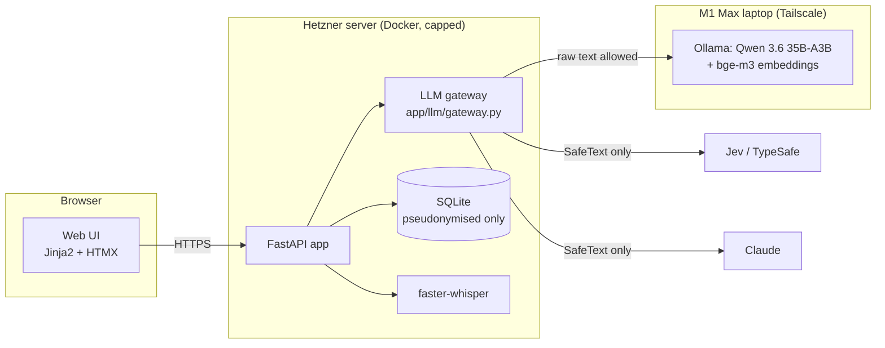

# Architecture

## Three kinds of model, one gateway

| Role (config/models.yaml) | Provider | Handles raw text? |
|---|---|---|
| pseudonymise | local Qwen | yes (local_only: must stay local) |
| extract, interviewer, embed | local Qwen / bge-m3 | pseudonymised |
| judge | Jev 1.13.0 | pseudonymised |
| plan, briefing, feedback, escalation | Claude Sonnet 5 | pseudonymised |
| interviewer_escalation, fallback_fast | Claude Haiku 4.5 | pseudonymised |

## The privacy boundary is a type

`SafeText` (app/llm/text.py) is the only thing external providers accept. It comes in two
kinds: `PseudonymisedText`, which only the pseudonymiser can create, and `TrustedText`, which may
only wrap string literals outside the prompt/catalog modules (checked by an AST test). A plain
`str` fails `isinstance(x, SafeText)`, and the gateway refuses it before any network call.

## The cascade

Jev answers typed questions with a confidence. Choice/Score answers below the configured
confidence, and Noul answers inside the uncertainty band, are escalated to Claude with the same
typed shape. Every judgment is stored with provider, confidence, `uncertain` and `escalated`,
so the review shows why each badge says what it says.

## A run

1. **Ingest:** parse (sandboxed subprocess) → regex + Qwen pseudonymisation → Jev doc-type +
   injection check → chunk with stable refs (`cv:role2:b3`, `vac:b4`).
2. **Prepare:** extract eisen/wensen (Qwen, retry, Claude) → evidence map (embeddings + Jev
   `evidence_for_req`) → focus list from a previous report → plan + briefing (Claude, rules
   enforced in code).
3. **Interview:** per answer: pseudonymise → Jev `next_move` (code enforces follow-up and time
   limits) → background evaluation (section 7.4) → next question from Qwen → Jev guardrails
   (regenerate → Claude → safe fallback).
4. **Review:** grounded feedback (sources validated, `fb_grounded`), stats computed in code,
   practice plan linked to answers/stats/tips, `report/v1` JSON + PDF with embedded JSON.

## Deviations from the spec

- No Caddy container: the host's nginx already owns 80/443; the app sits behind it.
- No Ollama container: Ollama runs on the laptop (decision D1), reached over Tailscale.
- Interviewer questions are not streamed token by token: every question must pass the
  guardrails before it is shown, so the UI shows a "thinking" state and then the checked question.
  Preparation and review progress use server-sent events.
- Deploys use `deploy/deploy.sh` from the laptop instead of a GitHub Action with SSH access to
  the server (the server also runs the trading bot).
